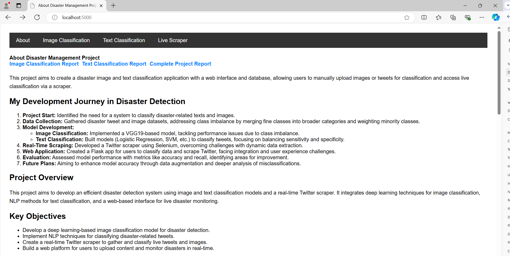

# Disaster Detection and Classification Application

## Objective
To create a disaster image and text classification application with a web interface and database, allowing users to manually upload images or tweets for classification and access live classification via a scraper.

## My Development Journey in Disaster Detection
1. **Project Start:** Identified the need for a system to classify disaster-related texts and images.
2. **Data Collection:** Gathered disaster tweet and image datasets, addressing class imbalance by merging fine classes into broader categories and weighting minority classes.
3. **Model Development:**
   - **Image Classification:** Implemented a VGG19-based model, tackling performance issues due to class imbalance.
   - **Text Classification:** Built models (Logistic Regression, SVM, etc.) to classify tweets, focusing on balancing sensitivity and specificity.
4. **Real-Time Scraping:** Developed a Twitter scraper using Selenium, overcoming challenges with dynamic data extraction.
5. **Web Application:** Created a Flask app for users to classify data and scrape Twitter, facing integration and user experience challenges.
6. **Evaluation:** Assessed model performance with metrics like accuracy and recall, identifying areas for improvement.
7. **Future Plans:** Aiming to enhance model accuracy through data augmentation and deeper analysis of misclassifications.

## Project Overview
This project aims to develop an efficient disaster detection system using image and text classification models and a real-time Twitter scraper. It integrates deep learning techniques for image classification, NLP methods for text classification, and a web-based interface for live disaster monitoring.

## Project Demo
Watch the demo video of the project here: [Demo Video](https://drive.google.com/file/d/1ILRuGV5wTZ7vKF1HfmcsBr_hfPbpb48t/view?usp=sharing)

### Key Objectives
- Develop a deep learning-based image classification model for disaster detection.
- Implement NLP techniques for classifying disaster-related tweets.
- Create a real-time Twitter scraper to gather and classify live tweets and images.
- Build a web platform for users to upload content and monitor disasters in real-time.

## Dataset Description
### Text Data
- **Sources:** Disaster Tweet Dataset (disaster-related) and Not-Spam Dataset (balanced text classification).
- **Preprocessing:** Includes data cleaning, handling imbalanced classes, and feature extraction using TF-IDF.
  
### Image Data
- **Sources:** Disaster images consolidated into broad classes to address class imbalance.
- **Preprocessing:** Techniques like rotation, shifts, shearing, and zooming for augmentation.

## Methodology
### Image Classification
- **Architecture:** VGG19 model with transfer learning.
- **Training:** Data preparation with augmentation, hyperparameter tuning, and evaluation metrics.

### Text Classification
- **Models Used:** Logistic Regression, Random Forest, XGBoost, SVM, RNN.
- **Preprocessing:** Tokenization, stopword removal, and feature extraction using TF-IDF and embeddings.

### Twitter Scraper
- **Functionality:** Utilizes Selenium to automate data extraction, cleans and uploads data to MongoDB.

## Web Application
- **Technologies:** Built with Flask, allowing users to classify images, texts, and initiate Twitter scraping.
- **Features:** Upload tabs for classification, real-time scraping, and JSON output for predictions.

## Results
### Image Classification Metrics
- Accuracy: 0.81 | Precision: 0.74 | Recall: 0.52 | F1-Score: 0.57 | Specificity: 0.85

### Text Classification Metrics
- **Logistic Regression:** Accuracy: 0.84 | Precision: 0.84 | Recall: 0.53 | F1-Score: 0.65
- **Random Forest:** Accuracy: 0.83 | Precision: 0.78 | Recall: 0.56 | F1-Score: 0.65
- **XGBoost:** Accuracy: 0.82 | Precision: 0.79 | Recall: 0.57 | F1-Score: 0.66

## Future Directions
Implement data augmentation, explore class weighting, and analyze misclassifications to improve accuracy across all classes.

## License
This project is licensed under the MIT License - see the [LICENSE](LICENSE) file for details.

## Acknowledgments
- Libraries: TensorFlow, Scikit-learn, Selenium, Flask, etc.
- Datasets: [Disaster Tweet Dataset](https://www.kaggle.com/c/nlp-getting-started) and other relevant datasets.
